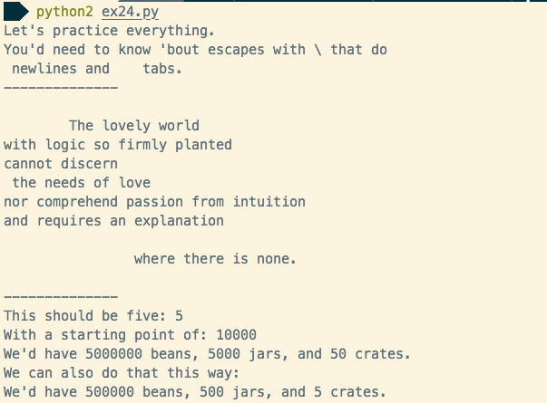

Learn Python the Hard Way Exercises
===

# Introduction

These are small Python challenges to become familiar with the language. All of the exercises can be found on the [Learn Python the Hard Way](http://learnpythonthehardway.org/) website.

# Running exercises

To run an exercise, install `Python 2.X` and run `python ex##.py`.

# Example screenshot

# Additional notes
More information can be found posted on [my blog](http://blog.digitalmockingbird.com/category/pythoneer/). 
